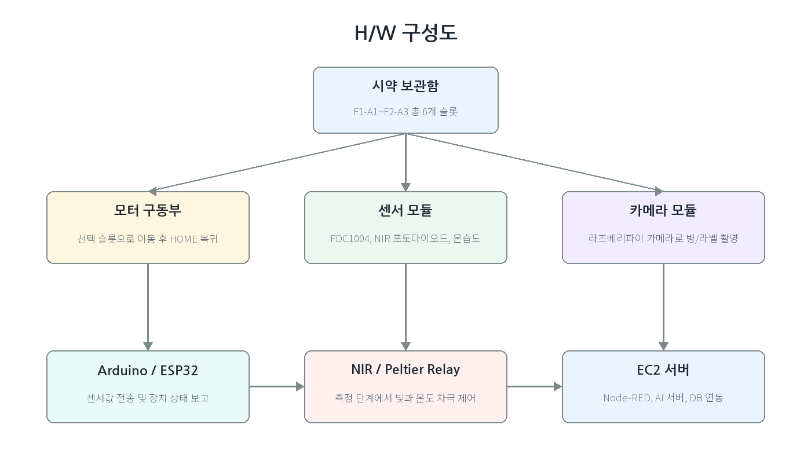
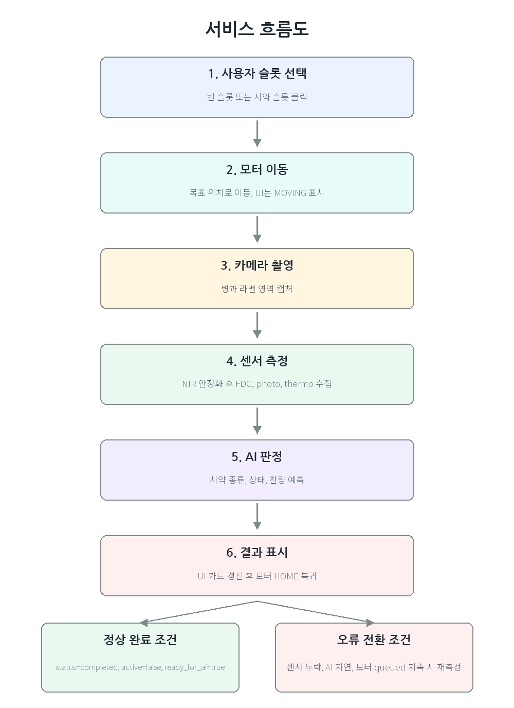

# AIRIS 시스템 상세

[프로젝트 개요](README.md)

## 하드웨어와 검사 순서

장치는 2층 3열의 6개 슬롯으로 구성합니다. 슬롯 ID는 `F1-A1`부터 `F2-A3`까지 사용하며, 센서 데이터와 화면의 검사 대상을 연결합니다. 카메라는 선택 위치로 이동하고, 턴테이블은 용기를 회전시켜 촬영과 측정을 지원합니다. 제어부의 5 V 전원과 구동부의 12 V 전원을 구분합니다.

| 부품 | 수집하거나 제어하는 값 | 설계에서 고려한 점 |
| --- | --- | --- |
| FDC1004 | 정전용량, 변화량 | 측정 포화, CAPDAC 범위 조정, 이동평균 |
| NIR LED와 포토다이오드 | 850 nm 광원에 대한 광량 및 ADC 값 | LED 점등 직후 안정화 구간 제외 |
| DHT22 | 온도와 습도 | 측정 환경과 열반응 해석 |
| Raspberry Pi 카메라 | 병과 라벨 영상 | OCR 후보와 센서 판정을 함께 활용 |
| 펠티어 및 팬 | 보관 환경 제어 | 센서 수집 시 구동 상태도 함께 기록 |

## 검사 상태 관리

사용자 요청은 장치 이동, 촬영, 센서 수집, 판정과 결과 표시 순서로 처리합니다. 중복 명령은 활성 검사 상태로 구분합니다. 센서 누락, AI 응답 오류나 모터 동작 이상이 있으면 정상 완료 대신 재측정 또는 오류 상태로 전환하도록 설계했습니다.

## 검사 데이터 구조

| 항목 | 의미 |
| --- | --- |
| `scan_id` | 한 번의 검사 세션을 구분하는 키 |
| `slot_id` | 시약이 놓인 물리적 슬롯 |
| `sensor_id`, `device_id` | 센서와 수집 장치의 식별자 |
| `phase`, `step_index` | 검사 단계와 측정 순서 |
| `captured_at`, `started_at` | 측정 시각과 검사 시작 시각 |
| `peltier_mode`, `nir_led_state` | 측정 당시 구동 및 광원 상태 |
| `temperature_c`, `humidity_pct` | 환경 측정값 |
| `capacitance_pf`, `photo_raw` | 정전용량과 광학 원시값 |

설계서의 DB 조회는 `scan_reading`과 `scan_session`을 `scan_id`로 결합하고, 측정 시간 순으로 정렬합니다. 학습용 정답에는 시약 라벨, 산염기성 라벨과 잔량 정보가 포함됩니다. Node-RED는 센서마다 다른 필드명을 공통 형식으로 변환한 뒤 저장합니다.

## API와 화면 갱신

React는 Node-RED proxy를 거쳐 FastAPI의 `/predict/scan`에 검사 ID를 전달합니다. AI 서버는 해당 검사 데이터를 조회하고 특징을 생성한 뒤 판정 결과를 반환합니다. `slot_id`는 `rg-001`부터 `rg-006`까지의 화면 ID로 매핑됩니다.

UI 응답의 주요 필드는 `id`, `name`, `status`, `level`, `isEmpty`, `sensors`입니다. 설계서 응답 예시의 `ph`와 고정 `pressure` 값은 실제 pH 센서나 압력 센서의 측정 성능을 의미하지 않습니다.

## 판정 파이프라인

1. 누락값과 센서 컬럼을 정리하고 측정값을 정규화합니다.
2. 검사별 시계열을 평균, 중앙값, 표준편차, 최소/최대, IQR, 변화량과 기울기로 요약합니다.
3. 산염기성, 시약명, 잔량과 이상 징후를 각각 판단합니다.
4. 신뢰도가 낮거나 라벨이 충돌하면 같은 슬롯의 과거 fingerprint를 검색합니다.
5. 가까운 이웃의 라벨 분포와 현재 판정의 신뢰도를 함께 고려해 보정합니다.

이 문서는 제작 설계서의 처리 흐름을 정리한 것입니다. 코드, 모델 파일과 실행 설정을 포함하는 실행 패키지는 아닙니다.
