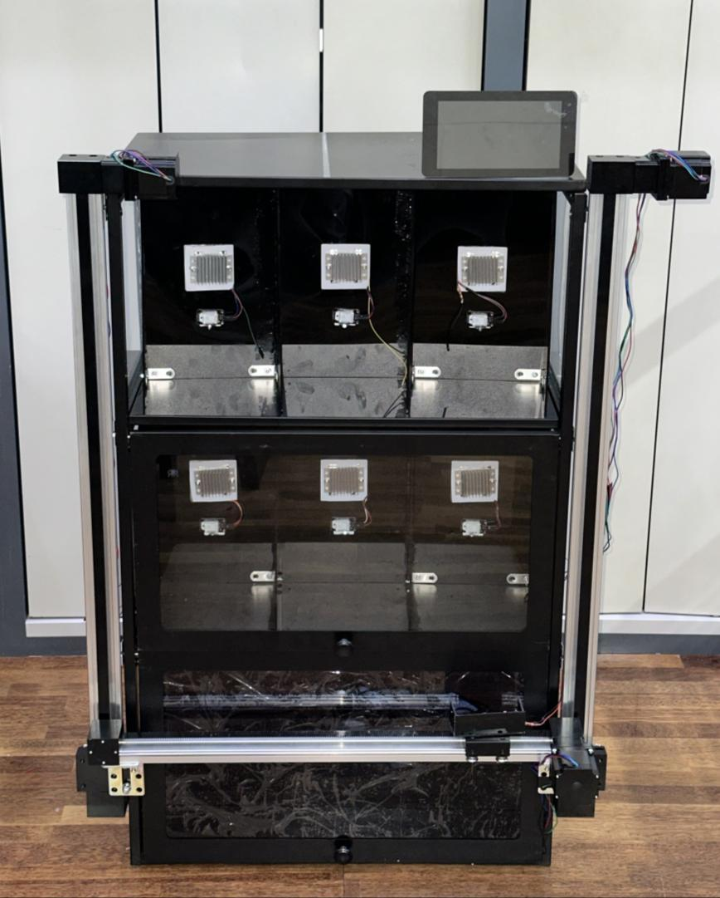
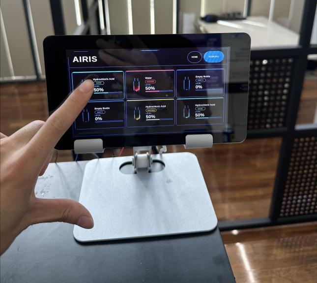
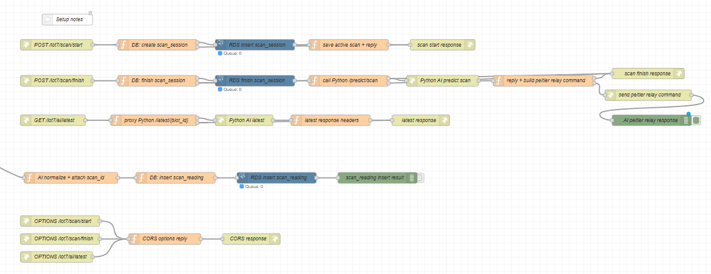
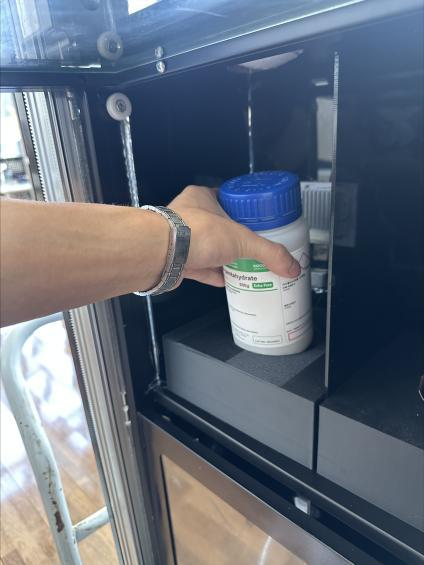
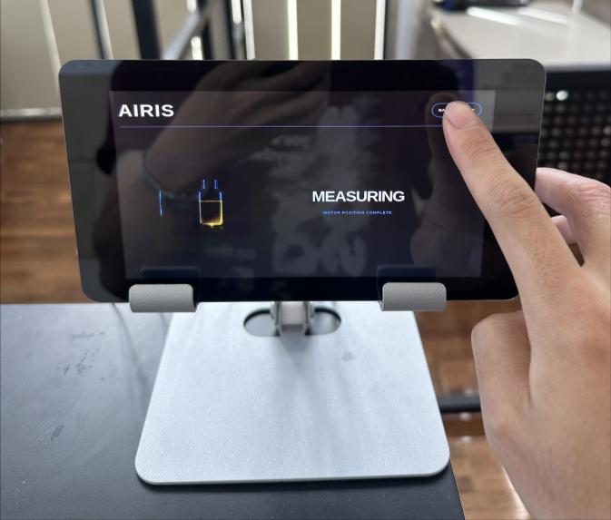

# AIRIS | 멀티센서 기반 시약 검사 시스템

시약병을 열지 않고 정전용량, 근적외선과 영상 정보를 수집해 시약 종류와 잔량을 판정하는 시스템입니다. 6개 슬롯의 장치 제어, 검사 데이터 저장, AI 판정과 React 화면을 연결했습니다.

 

*실제 제작 장치와 6개 슬롯의 검사 화면. 사진은 프로젝트 발표자료와 제작 설계서에서 발췌했습니다.*

**담당 경험:** 센서 데이터 경로 분석과 정전용량 측정 안정화. 원시값, 장치 전송값, 서버 저장값을 비교해 포화 원인을 추적하고 CAPDAC 자동 조정과 이동평균을 적용했습니다.

[시스템 상세](ARCHITECTURE.md) | [장치 및 화면 사진](GALLERY.md) | [자료 기준](SOURCES.md)

## 해결하려는 문제

시약 라벨만으로는 현재 잔량이나 센서 반응을 확인하기 어렵습니다. 같은 시약도 병과 센서 위치에 따라 측정값이 달라집니다. AIRIS는 시약을 슬롯별로 고정하고, 한 번의 검사에 해당하는 데이터를 묶어 판정과 이력을 연결합니다.

## 검사 과정

1. 화면에서 슬롯을 선택하면 카메라와 구동부가 검사 위치로 이동합니다.
2. 병과 라벨을 촬영하고 OCR 정보로 시약 후보를 식별합니다.
3. NIR 광원이 안정화된 뒤 정전용량, 광량, 온도와 습도를 수집합니다.
4. 검사 단위로 특징을 집계하고 시약 분류, 잔량 추정과 보정을 수행합니다.
5. 슬롯에 해당하는 UI 카드를 갱신하고 검사 결과를 저장합니다.

## 시스템 구조

| 계층 | 구성과 역할 |
| --- | --- |
| 측정 | FDC1004 정전용량 센서, 850 nm NIR LED와 포토다이오드, DHT22, 카메라 |
| 장치 제어 | ESP32와 Raspberry Pi, 모터 위치 이동, 턴테이블, 릴레이 제어 |
| 연동 | Node-RED에서 요청 라우팅, 측정 상태 관리, 센서 payload 정규화 |
| 검사 데이터 | PostgreSQL RDS의 `scan_session`과 `scan_reading`을 `scan_id`로 연결 |
| 판정 | FastAPI가 검사 데이터를 조회하고 특징 생성, 분류, 회귀와 kNN 보정 수행 |
| 사용자 화면 | React에서 슬롯별 시약명, 검사 상태, 잔량과 센서값 표시 |

*검사 시작과 종료, 센서 저장, AI 호출을 연결한 Node-RED 화면.*

## 데이터와 AI 판정

센서의 순간값만 비교하지 않고 검사 세션별 평균, 표준편차, 변화량, 범위, 기울기와 포화 비율을 생성합니다. 산성/중성/염기성 분류, 세부 시약명 분류, 잔량 회귀와 이상 징후 판단을 구분합니다.

슬롯마다 광량과 센서 설치 조건이 달라질 수 있어, 신뢰도가 낮거나 판정이 충돌하면 같은 슬롯의 과거 측정 특징과 kNN으로 비교합니다. 안정적인 중성 판정을 약한 이웃 근거만으로 뒤집지 않는 보호 규칙도 설계했습니다.

제작 설계서는 Random Forest, ExtraTrees, kNN과 Isolation Forest 조합을 설명합니다. 발표자료의 MLP 설명과는 구성이 달라, 상세 문서에 각 자료의 범위를 구분했습니다.

## 문제 해결: 정전용량 측정 포화

| 단계 | 수행 내용 |
| --- | --- |
| 증상 | 특정 측정 조건에서 값이 불안정해지고 포화되는 현상 반복 |
| 추적 | 센서 원시값 → 장치 전송값 → 서버 저장값을 비교해 통신 및 저장 중 변형 여부 확인 |
| 조치 | 센서 측정 범위와 CAPDAC 설정을 점검하고, 측정값에 따른 자동 조정 및 이동평균 적용 |
| 확인 | 시약과 측정 조건을 변경해 반복 측정하며 안정화 여부 확인 |

## 구현 화면과 확인 범위

 

슬롯 적재, 터치 화면, 이동 및 측정 상태 화면을 실제 사진으로 확인할 수 있습니다. 사진에 표시된 잔량이나 상태는 화면 예시이며, 분류 정확도나 잔량 오차의 평가 결과로 사용하지 않습니다.

이 저장소는 구현 설명, 설계 문서와 장치 사진을 제공합니다. 소스코드와 학습 데이터는 포함하지 않습니다.
